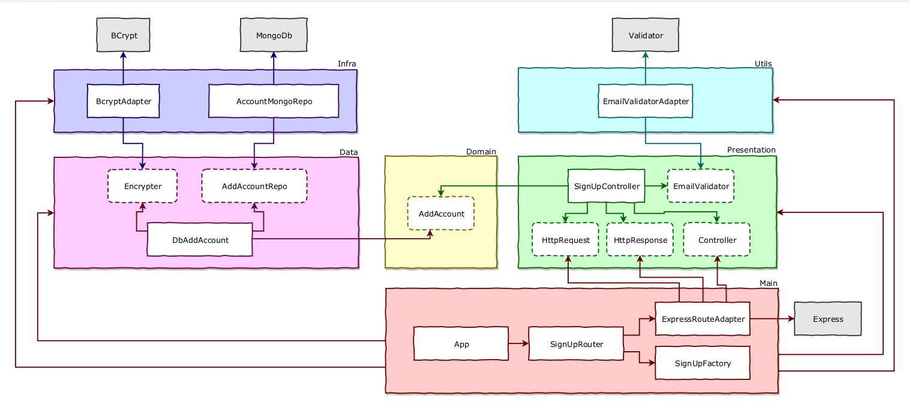
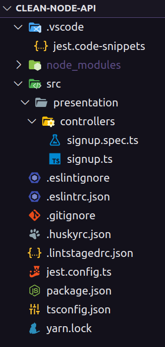
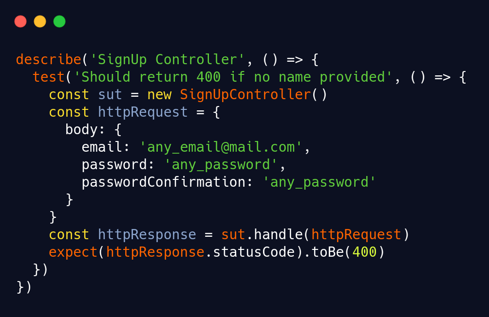
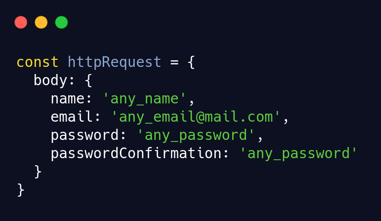
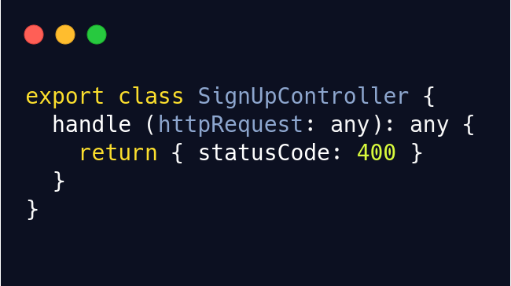
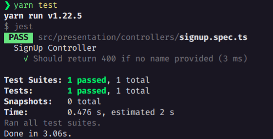
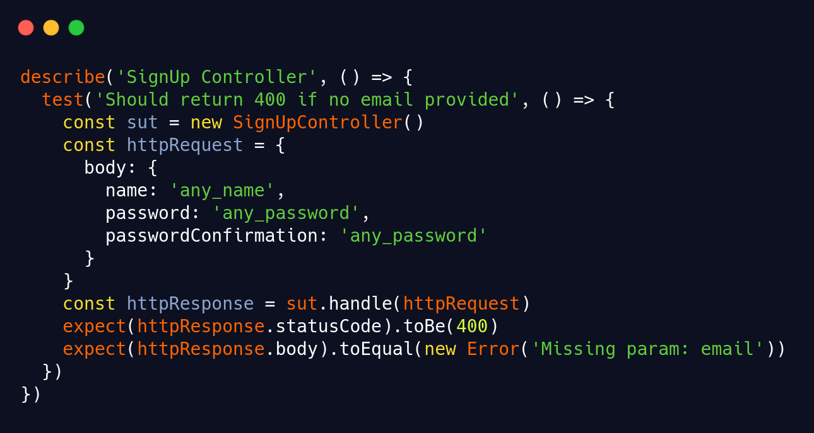
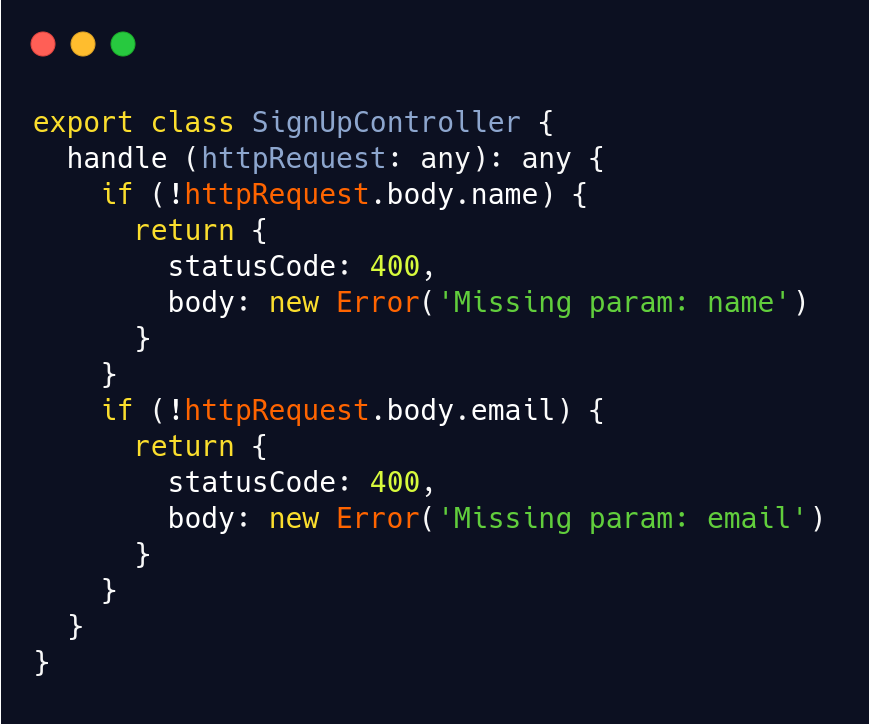

<h3 align="center">NodeJs, Typescript, TDD, DDD, Clean Architecture e SOLID</h3>

---

  

  
   
  

---

  <a href="#-information_source-sobre-a-aula">Sobre</a> •
  <a href="#-open_file_folder-tópicos">Tópicos</a> • 
  <a href="#-woman_office_worker-autora">Autora</a> • 
  <a href="#-pencil-licença">Licença</a>

 

# ℹ️ Sobre o projeto 

Criação do SignUpController, validando o request e criando erros personalizados.

# 📂 Tópicos

## ℹ️ Diagrama

 

 

## 📂 Estrutura

 

 

## 📂 signup.spec.ts

 

▶️ Rota com nome, email e senha para criar a conta de usuário

 

### ⁉️ Verificar se foi enviado a variável `name`

 

✔️ Validar se os parâmetros estão vindo corretamente do `client`
  - `sut` => system under test => facilita a identificação de qual classe está sendo testada.

✔️ Invocar a função `handle` que recebe uma requisição e retorna uma resposta

✔️ As variáveis esperadas por essa rota são:

✔️ Fazer a requisição eliminando a variável `name` da variável `httpRequest`

✔️ Criar arquivo de produção do `Teste1` => **signup.ts**

✔️ **signup.ts:**
  - deve possuir o método `handle` que recebe `httpRequest` e retorna `httpResponse`
  - importar o `SignupController` no *Test 1*

✔️ Foi instalada a extensão [Jest](https://marketplace.visualstudio.com/items?itemName=Orta.vscode-jest), que já faz o verificação do test conforme é escrito. Caso não deseje utilizar a extensão, rodar o teste.

:floppy_disk: Commitar as alterações

 

### ⁉️ Verificar se foi enviado a variável `email`

✔️ Serão realizadas os mesmo passos da verificação do `name`, alterando a variável para `email`.

✔️ Refatoração da **signup.ts** para que verifique qual a validação está sendo realizada e retorno o erro adequado.

✔️ Testar e commitar.

 

# 👩‍💼 Autora

 
 
<b>Nádia Ligia</b>

  

 

# 📝 Licença

Esse projeto está sob a licença MIT. Veja o arquivo [LICENSE](../LICENSE) para mais detalhes.